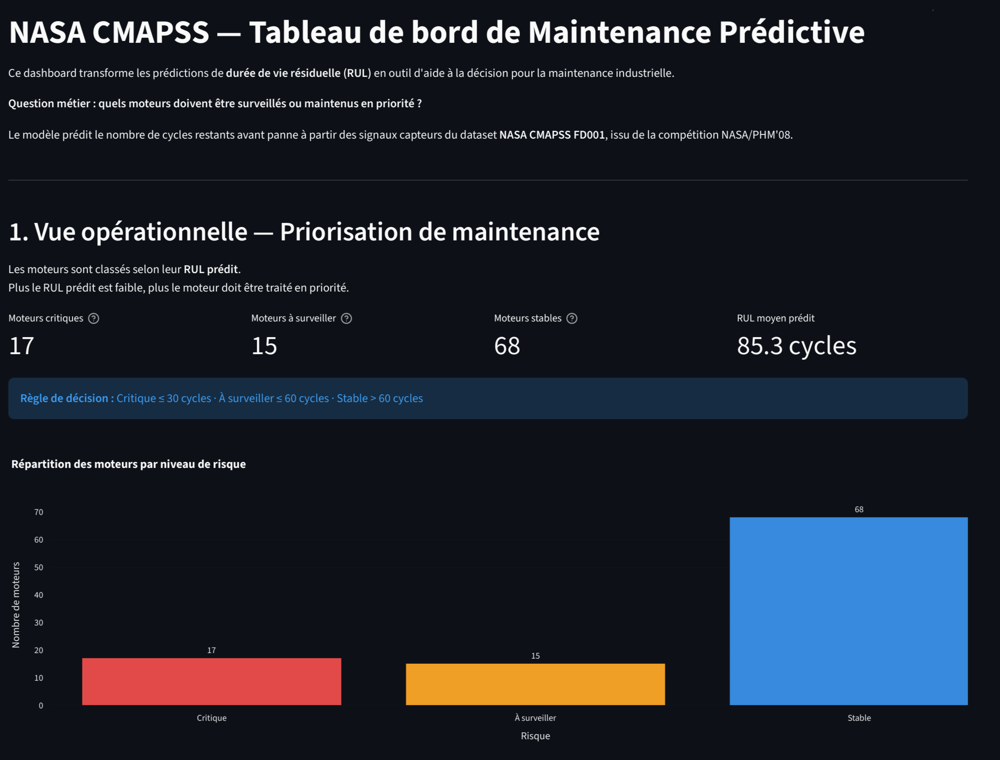
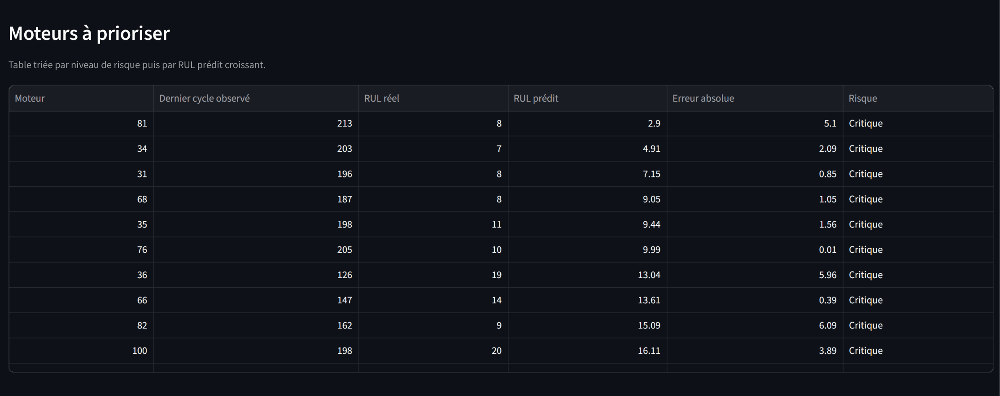
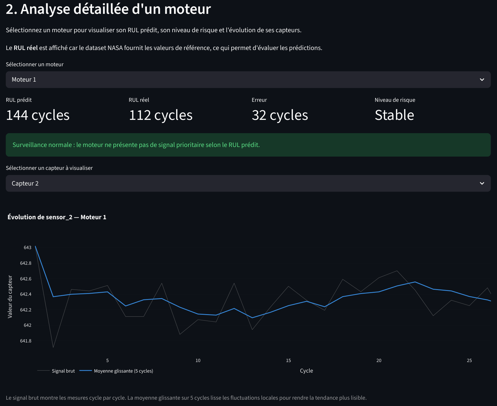

# NASA CMAPSS — Maintenance Prédictive & Prédiction de RUL


Projet Data Science de bout en bout sur le dataset de référence **NASA CMAPSS FD001**.

L'objectif est de prédire la **durée de vie résiduelle** d'un moteur industriel, appelée **RUL — Remaining Useful Life**, à partir de signaux capteurs.  
Le projet couvre toute la chaîne : ingestion, exploration, preprocessing, feature engineering, modélisation, évaluation, couche analytique SQL et dashboard Streamlit orienté aide à la décision.

> *"The task was to estimate remaining life of an unspecified system using historical data only."*  
> — Saxena et al. (2008), p.1 — [PDF](docs/Damage_Propagation_Modeling.pdf)

---

## Résumé exécutif

Ce projet répond à une problématique industrielle simple :

> **Quels moteurs doivent être maintenus en priorité avant qu'une panne ne survienne ?**

À partir de données capteurs simulant le vieillissement de moteurs, un modèle de Machine Learning prédit le nombre de cycles restants avant panne.  
Les prédictions sont ensuite transformées en niveaux de risque opérationnels :

- **Critique** : maintenance prioritaire
- **À surveiller** : maintenance à planifier
- **Stable** : surveillance normale

Le dashboard permet donc de passer d'une prédiction ML à une décision métier directement exploitable.

---

## Ce que montre ce projet

Ce projet montre ma capacité à transformer un problème industriel en solution data complète : analyse des données, modèle prédictif, évaluation des performances, stockage SQL des résultats et dashboard d'aide à la décision.

---

## Résultats clés

| Élément | Résultat |
|---|---:|
| Dataset | NASA CMAPSS FD001 |
| Nombre de moteurs test | 100 |
| Meilleur modèle retenu | Random Forest Regressor |
| RMSE test | **23.16 cycles** |
| MAE test | **16.72 cycles** |
| NASA Score test | **5,331.90** |
| Dashboard | Streamlit déployé en ligne |
| Couche analytique | SQLite — requêtes SQL métier |

Le modèle obtient une erreur moyenne absolue de **16.72 cycles** sur le test set NASA.  
Les prédictions sont ensuite converties en niveaux de risque afin de prioriser les moteurs nécessitant une intervention de maintenance.

---

## Dashboard

**Dashboard live** → [nasa-cmapss-rul-prediction.streamlit.app](https://nasa-cmapss-rul-prediction.streamlit.app/)

### Vue opérationnelle

La vue opérationnelle synthétise les moteurs critiques, les moteurs à surveiller et les moteurs stables afin de prioriser les actions de maintenance.



### Table de priorisation

Les moteurs sont triés par niveau de risque puis par RUL prédit croissant. Les moteurs les plus urgents apparaissent en haut de la table.



### Analyse détaillée d'un moteur

Cette vue permet d'analyser un moteur spécifique : RUL prédit, RUL réel, erreur de prédiction, niveau de risque et évolution d'un capteur au fil des cycles.



---

## Contexte métier

La maintenance prédictive est un enjeu critique dans les secteurs industriels : énergie, aéronautique, manufacturing, transport ou Oil & Gas.

Une panne non anticipée peut entraîner :

- des arrêts de production coûteux ;
- des interventions de maintenance urgentes ;
- des risques de sécurité ;
- une mauvaise allocation des ressources techniques.

L'objectif de ce projet est donc de prédire le plus tôt possible la durée de vie restante d'un moteur, afin d'aider les équipes opérationnelles à prioriser les interventions.

> *"Reliably estimating remaining life holds the promise for considerable cost savings (for example by avoiding unscheduled maintenance and by increasing equipment usage) and operational safety improvements."*  
> — Saxena et al. (2008), p.2 — [PDF](docs/Damage_Propagation_Modeling.pdf)

---

## Objectif Data Science

À partir de l'historique des capteurs d'un moteur, le modèle doit estimer son **RUL**, c'est-à-dire le nombre de cycles restants avant panne.

Le problème est formulé comme une tâche de **régression supervisée** :

```text
Entrée  : signaux capteurs + features temporelles
Sortie  : RUL estimé en nombre de cycles
Modèles : Ridge Regression baseline + Random Forest Regressor
```

---

## Dataset

Le projet utilise le sous-ensemble **FD001** du dataset NASA CMAPSS (Commercial Modular Aero-Propulsion System Simulation).

FD001 correspond à un cas simplifié — une seule condition opérationnelle (Sea Level) et un seul mode de défaillance (HPC Degradation) — ce qui en fait le point d'entrée naturel pour développer et valider un pipeline de maintenance prédictive avant de généraliser aux sous-ensembles plus complexes (FD002 à FD004).

> *"Each engine starts with different degrees of initial wear and manufacturing variation which is unknown to the user. This wear and variation is considered normal, i.e., it is not considered a fault condition."*  
> — NASA CMAPSS Dataset Description — [dataset_info.txt](docs/dataset_info.txt)

| Propriété | FD001 |
|---|---|
| Condition opérationnelle | ONE (Sea Level) |
| Mode de défaillance | ONE (HPC Degradation) |
| Moteurs train set | 100 |
| Moteurs test set | 100 |
| Capteurs disponibles | 21 |

Le moteur simulé est un turbofan de la classe 90 000 lb de poussée, modélisé par C-MAPSS. Les 21 capteurs disponibles couvrent des mesures de température, pression, vitesse de rotation et débits à différents étages du moteur (Table 2, Saxena et al., 2008, p.3 — [PDF](docs/Damage_Propagation_Modeling.pdf)).

Le train set contient des moteurs observés jusqu'à la panne — le critère d'arrêt est l'index de santé H = 0, défini comme le minimum de plusieurs marges opérationnelles (stall margins HPC, LPC, Fan et EGT). Le test set contient des moteurs tronqués avant la panne, avec un fichier séparé donnant le RUL réel final.

> *"The training set had trajectories that ended at the failure threshold while the test and validation sets were pruned to stop some time prior to the failure threshold."*  
> — Saxena et al. (2008), p.7, Section VI — [PDF](docs/Damage_Propagation_Modeling.pdf)

Source : [NASA CMAPSS Dataset](https://data.nasa.gov/dataset/cmapss-jet-engine-simulated-data) — open data, usage non commercial.  
Documentation originale NASA : [docs/dataset_info.txt](docs/dataset_info.txt)  
Article de référence : [Damage Propagation Modeling (PDF)](docs/Damage_Propagation_Modeling.pdf)

---

## Architecture du projet

```text
nasa-cmapss-rul-prediction/
│
├── assets/                         # Captures du dashboard
│
├── dashboard/
│   └── app.py                      # Dashboard Streamlit
│
├── data/
│   ├── raw/                        # Données NASA CMAPSS brutes
│   └── processed/                  # Données nettoyées, features, prédictions
│
├── database/                       # Dossier local pour la base SQLite générée
│   └── cmapss.db                   # Générée par db.py — non versionnée (.gitignore)
│
├── docs/
│   ├── dataset_info.txt            # Documentation NASA originale du dataset
│   └── Damage_Propagation_Modeling.pdf  # Article PHM'08 — Saxena et al. (2008)
│
├── models/                         # Artefacts modèles sauvegardés
│
├── notebooks/
│   └── 01_eda_fd001.ipynb          # Exploration et analyse des données
│
├── sql/
│   └── queries.sql                 # Requêtes métier réutilisables
│
├── src/
│   ├── database/
│   │   ├── db.py                   # Construction de la base SQLite
│   │   └── run_queries.py          # Exécution des requêtes métier
│   ├── features/
│   │   └── engineer.py             # Rolling mean, delta, features temporelles
│   ├── ingestion/
│   │   └── load.py                 # Chargement des données et calcul du RUL train
│   ├── models/
│   │   └── train.py                # Baseline, Random Forest, évaluation, prédictions
│   └── preprocessing/
│       └── clean.py                # Nettoyage, suppression capteurs, cap RUL
│
├── requirements.txt
└── README.md
```

---

## Pipeline du projet

```text
Données NASA CMAPSS FD001
        │
        ▼
load.py
        ├── chargement train/test/RUL
        └── calcul du RUL train : max_cycle - cycle
        │
        ▼
01_eda_fd001.ipynb
        ├── distribution du RUL
        ├── analyse des capteurs
        ├── détection des capteurs quasi-constants
        └── justification des choix de preprocessing
        │
        ▼
clean.py
        ├── suppression des capteurs quasi-constants
        └── cap du RUL à 150 cycles
        │
        ▼
engineer.py
        ├── rolling mean sur 5 cycles
        ├── delta cycle à cycle
        └── construction de 24 features pour FD001
        │
        ▼
train.py
        ├── split train/validation par moteur
        ├── Ridge baseline
        ├── Random Forest
        ├── évaluation RMSE · MAE · score NASA
        └── génération des prédictions test
        │
        ▼
db.py
        ├── création de la base SQLite
        ├── chargement des prédictions, métriques et capteurs
        └── couche analytique SQL réutilisable
        │
        ▼
app.py
        └── dashboard Streamlit — interroge SQLite si disponible, CSV sinon
```

---

## Approche méthodologique

### 1. Exploration des données

L'EDA sur FD001 montre que plusieurs capteurs parmi les 21 disponibles sont quasi-constants sur l'ensemble des trajectoires et n'apportent pas de signal de dégradation exploitable.

Ce phénomène est cohérent avec la description du dataset : pour FD001, une seule condition opérationnelle (Sea Level) et un seul mode de défaillance (HPC Degradation) sont simulés. Les capteurs non sensibles à cette dégradation spécifique restent naturellement stables.

> Les 21 capteurs couvrent des mesures de température (T2, T24, T30, T50), de pression (P2, P15, P30, Ps30), de vitesse (Nf, Nc, NRf, NRc), et d'autres variables opérationnelles (BPR, farB, htBleed, etc.).  
> — Saxena et al. (2008), p.3, Table 2 — [PDF](docs/Damage_Propagation_Modeling.pdf)

Ces capteurs sont supprimés afin de réduire le bruit, simplifier le modèle et concentrer l'apprentissage sur les signaux réellement informatifs.

Pour FD001, **8 capteurs** sont retenus après analyse de la variance.

---

### 2. Preprocessing

| Étape | Choix | Justification |
|---|---|---|
| Suppression capteurs | écart-type < 0.5 | Seuil défini à partir de l'EDA pour retirer les capteurs quasi-constants sur FD001 |
| Cap RUL | 150 cycles | Borne maximale des RUL du test set FD001 selon Saxena et al. (2008) |
| Split validation | par moteur | Évite le data leakage entre les cycles d'un même moteur |

**Sur le cap du RUL à 150 cycles** : ce choix est directement ancré dans la description du dataset. Saxena et al. précisent que les RUL du test set FD001 sont compris entre 10 et 150 cycles. Fixer un plafond à 150 cycles dans le train set permet d'aligner le modèle sur la plage effective du test set.

> *"The test data set RULs ranged between 10 and 150 cycles."*  
> — Saxena et al. (2008), p.7, Section VI — [PDF](docs/Damage_Propagation_Modeling.pdf)

Au-delà de 150 cycles, les moteurs du train set sont encore loin de la défaillance. Leur RUL exact importe peu pour la tâche : l'objectif est d'apprendre à estimer la durée de vie résiduelle dans la plage couverte par le test set, et non de prédire des horizons très lointains avec une précision artificielle.

---

### 3. Feature engineering

Pour chaque capteur retenu, deux types de features temporelles sont ajoutés :

- **Rolling mean sur 5 cycles** : lisse les fluctuations locales liées au bruit de mesure et rend la tendance de dégradation plus lisible. Ce bruit multi-couche est inhérent au dataset : Saxena et al. décrivent une contamination combinant bruit de fabrication, bruit de processus et bruit de mesure, délibérément conçue pour reproduire les défis du signal réel (Section V.B, p.5–6 — [PDF](docs/Damage_Propagation_Modeling.pdf)).
- **Delta cycle à cycle** : capture la variation instantanée du signal, complémentaire de la tendance lissée.

Pour FD001 :

```text
8 capteurs bruts + 8 rolling means + 8 deltas = 24 features
```

---

### 4. Validation par moteur

Le split train/validation est effectué **par moteur** et non par ligne.

Cette étape est essentielle : si les cycles d'un même moteur étaient répartis à la fois dans le train et dans la validation, le modèle pourrait apprendre des patterns propres à ce moteur, ce qui créerait du **data leakage**. Ce risque est d'autant plus réel que chaque moteur du dataset démarre avec un niveau d'usure initiale différent, inconnu du modèle.

> *"Each engine starts with different degrees of initial wear and manufacturing variation which is unknown to the user."*  
> — NASA CMAPSS Dataset Description — [dataset_info.txt](docs/dataset_info.txt)

- 80 moteurs → entraînement
- 20 moteurs → validation

---

## SQL Analytics Layer

Les sorties du pipeline sont persistées dans une base **SQLite** (`database/cmapss.db`), générée localement :

```bash
python src/database/db.py
```

| Table | Contenu |
|---|---|
| `predictions` | RUL prédit, RUL réel, erreur absolue, niveau de risque par moteur |
| `metrics` | RMSE, MAE, score NASA pour chaque modèle |
| `sensor_readings` | Signaux capteurs bruts et features temporelles par cycle |

Le fichier `sql/queries.sql` contient des requêtes métier réutilisables :

- moteurs critiques ;
- répartition des niveaux de risque ;
- analyse des erreurs de prédiction ;
- RUL moyen par catégorie ;
- évolution d'un capteur pour un moteur donné.

```bash
python src/database/run_queries.py
```

Cette couche permet de traiter les sorties du modèle comme une base analytique interrogeable, plutôt que comme de simples fichiers CSV.

> La base SQLite n'est pas versionnée — elle est générée localement à partir des fichiers du pipeline. Le dashboard bascule automatiquement sur les fichiers CSV si la base n'est pas disponible, par exemple sur Streamlit Cloud.

---

## Métriques d'évaluation

Le modèle est évalué à l'aide de métriques de régression classiques ainsi que d'une métrique spécifique à la maintenance prédictive.

L'objectif n'est pas seulement de mesurer l'erreur moyenne du modèle, mais aussi de comprendre la criticité métier des erreurs : dans un contexte industriel, surestimer la durée de vie restante d'un moteur peut être plus risqué que la sous-estimer.

---

### MAE — Mean Absolute Error

La MAE mesure l'écart absolu moyen entre le RUL prédit et le RUL réel.

$$
MAE = \frac{1}{n} \sum_{i=1}^{n} \left| RUL_i - \widehat{RUL}_i \right|
$$

où :

- $RUL_i$ correspond au RUL réel ;
- $\widehat{RUL}_i$ correspond au RUL prédit ;
- $n$ correspond au nombre d'observations.

Cette métrique est facilement interprétable car elle est exprimée directement en nombre de cycles.

> Sur le test set NASA, le modèle se trompe en moyenne de **16.72 cycles**.

---

### RMSE — Root Mean Squared Error

La RMSE correspond à la racine carrée de la MSE.

$$
RMSE = \sqrt{ \frac{1}{n} \sum_{i=1}^{n} \left( RUL_i - \widehat{RUL}_i \right)^2 }
$$

Elle mesure l'erreur moyenne du modèle en donnant plus de poids aux grandes erreurs.

Contrairement à la MSE, la RMSE est exprimée dans la même unité que la cible, c'est-à-dire en nombre de cycles. Elle est donc plus facile à interpréter dans un contexte de maintenance prédictive.

> Sur le test set NASA, le modèle obtient une **RMSE de 23.16 cycles**.

---

### NASA Score / PHM08 Score

Le NASA Score, aussi appelé PHM08 Score, est une métrique spécifique à la prédiction du Remaining Useful Life, définie dans l'article de référence du dataset.

Contrairement à la MAE ou à la RMSE, il applique une pénalité asymétrique : les surestimations du RUL sont davantage pénalisées que les sous-estimations, car elles peuvent retarder une intervention de maintenance et conduire à une panne non anticipée.

> *"For an engine degradation scenario an early prediction is preferred over late predictions. Therefore, the scoring algorithm for this challenge was asymmetric around the true time of failure such that late predictions were more heavily penalized than early predictions."*  
> — Saxena et al. (2008), p.7, Section VII — [PDF](docs/Damage_Propagation_Modeling.pdf)

Cette logique est particulièrement adaptée à la maintenance prédictive :

- sous-estimer le RUL conduit à une maintenance anticipée ;
- surestimer le RUL est plus critique, car cela peut conduire à une panne non anticipée et à un risque opérationnel plus élevé.

Le score est défini par l'équation (11) de Saxena et al. (2008) :

$$
s = \sum_{i=1}^{n}
\begin{cases}
e^{-d_i / 13} - 1, & \text{si } d_i < 0 \\
e^{d_i / 10} - 1, & \text{si } d_i \geq 0
\end{cases}
$$

avec $d_i = \widehat{RUL}_i - RUL_i$, $a_1 = 10$ et $a_2 = 13$.

où :

- $\widehat{RUL}_i$ correspond au RUL prédit ;
- $RUL_i$ correspond au RUL réel ;
- $d_i < 0$ signifie que le modèle sous-estime le RUL ;
- $d_i \geq 0$ signifie que le modèle surestime le RUL.

Le NASA Score n'est pas borné et ne s'interprète pas comme un pourcentage ou une note sur 100.  
Plus le score est faible, meilleur est le modèle. Un score de 0 correspondrait à des prédictions parfaites.

> Sur le test set NASA, le modèle obtient un **NASA Score de 5 331.90** sur 100 moteurs, soit une pénalité asymétrique moyenne d'environ **53.3 points par moteur**.  
> Comme ce score n'est pas borné, il s'interprète surtout par comparaison avec d'autres modèles ou baselines.

En pratique, cette métrique permet d'évaluer non seulement la précision statistique du modèle, mais aussi la criticité métier des erreurs de prédiction.

> Saxena et al. (2008), p.7, Section VII, eq. (11) — [PDF](docs/Damage_Propagation_Modeling.pdf)

---

## Modélisation

Deux modèles sont comparés :

- **Ridge Regression** : baseline simple, linéaire et interprétable.
- **Random Forest Regressor** : modèle non linéaire capable de capter des interactions entre capteurs.

### Résultats validation — tous les cycles

| Modèle | RMSE | MAE |
|---|---:|---:|
| Ridge baseline | 24.73 | 19.39 |
| Random Forest | **21.60** | **15.98** |

Le Random Forest améliore la RMSE et la MAE par rapport à la baseline Ridge sur la validation interne.

Le NASA Score n'est pas reporté sur cette évaluation, car il est principalement pertinent dans un scénario de prédiction finale du RUL par moteur. L'évaluation "tous les cycles" sert ici à comparer les erreurs moyennes des modèles sur l'ensemble des observations disponibles.

---

### Résultats test NASA — dernier cycle observé

| Métrique | Valeur |
|---|---:|
| RMSE | **23.16 cycles** |
| MAE | **16.72 cycles** |
| Score NASA | **5,331.90** |

Le test set NASA est évalué sur les 100 moteurs test, à partir du dernier cycle observé pour chaque moteur.  
Contrairement au train set, les moteurs test sont tronqués avant la panne — leurs RUL réels sont compris entre 10 et 150 cycles (Saxena et al., 2008, p.7, Section VI — [PDF](docs/Damage_Propagation_Modeling.pdf)).

---

> **Note sur l'évaluation "last cycle"**  
> Une évaluation "last cycle" sur le split validation interne donne des scores très faibles, car les moteurs du train set sont observés jusqu'à la panne — le dernier cycle correspond donc à un RUL proche de zéro.  
> Cette métrique n'est pas directement comparable au test set NASA, où les moteurs sont volontairement tronqués avant défaillance.  
> **La performance principale à retenir : validation all cycles RMSE 21.60 — test NASA RMSE 23.16.**

---

## Interprétation des résultats

Le Random Forest obtient de meilleures performances que la baseline Ridge sur les métriques classiques, avec une RMSE validation de **21.60 cycles** et une RMSE test de **23.16 cycles**.

Cette observation reste toutefois à compléter par une analyse plus fine des erreurs. En maintenance prédictive, il ne suffit pas de réduire l'erreur moyenne : il faut aussi surveiller les surestimations du RUL, car elles peuvent retarder une intervention de maintenance.

Saxena et al. soulignent d'ailleurs que la métrique PHM'08 peut être enrichie d'un score de corrélation pour distinguer des algorithmes d'égal score agrégé mais de comportement très différent sur les cas individuels.

> *"Since the metric is a combined aggregate of performance for individual UUTs, an additional correlation metric should be employed to ensure that an algorithm consistently predicts well for all cases."*  
> — Saxena et al. (2008), p.8, Section VII — [PDF](docs/Damage_Propagation_Modeling.pdf)

Le Random Forest est retenu ici comme modèle principal car il obtient les meilleures performances sur les métriques classiques de régression, avec une RMSE validation de **21.60 cycles** et une RMSE test de **23.16 cycles**. Il permet également de produire des prédictions exploitables dans un dashboard métier de priorisation maintenance.

Dans un contexte industriel réel, le choix final du modèle devrait aussi intégrer :

- la précision globale ;
- la fréquence et l'amplitude des surestimations du RUL ;
- le coût d'une maintenance anticipée ;
- le coût d'une panne non anticipée ;
- les contraintes opérationnelles de l'équipe maintenance.

---

## Dashboard Streamlit

Le dashboard répond à trois questions opérationnelles :

1. **Quels moteurs sont prioritaires pour la maintenance ?**  
   Vue opérationnelle avec niveaux de risque et table de priorisation.

2. **Quel est l'état détaillé d'un moteur donné ?**  
   Analyse individuelle avec RUL prédit, RUL réel, erreur, niveau de risque et courbes capteurs.

3. **Peut-on faire confiance aux prédictions ?**  
   Métriques RMSE, MAE, score NASA, comparaison baseline et visualisation des erreurs.

### Niveaux de risque utilisés

| Niveau | Règle | Action métier |
|---|---|---|
| Critique | RUL prédit ≤ 30 cycles | Maintenance prioritaire |
| À surveiller | RUL prédit ≤ 60 cycles | Maintenance à planifier |
| Stable | RUL prédit > 60 cycles | Surveillance normale |

---

## Remarque sur l'usage du dashboard

Le dashboard est conçu comme un outil de démonstration analytique et d'aide à la décision.

Dans ce projet, le RUL réel est affiché pour permettre d'évaluer la qualité des prédictions sur le test set NASA.  
Dans un cas d'usage industriel réel, le RUL réel ne serait pas connu à l'avance : seules les prédictions du modèle et les signaux capteurs seraient disponibles.

Le dashboard illustre donc la manière dont un modèle de prédiction de RUL peut être transformé en outil de priorisation opérationnelle.

---

## Ce que j'ai appris — Décisions techniques clés

- **Séparer preprocessing et feature engineering** permet de mieux contrôler ce qu'on donne au modèle et facilite les itérations.
- **Valider par moteur et non par ligne** est essentiel sur des données de séries temporelles pour éviter le data leakage — d'autant que chaque moteur du dataset démarre avec un niveau d'usure initial différent et inconnu.
- **Persister les prédictions en base SQLite** rapproche le projet d'un workflow analytique en entreprise et permet d'écrire des requêtes métier directement exploitables.
- **Relier les métriques ML à un risque métier** permet de dépasser une simple évaluation statistique et de rendre le modèle exploitable pour la maintenance.
- **La métrique "last cycle" sur le train set est trompeuse** : les moteurs train vont jusqu'à la panne, contrairement au test set NASA dont les RUL sont compris entre 10 et 150 cycles.
- **Un Random Forest sans optimisation avancée** constitue une baseline non linéaire solide, mais une amélioration future devrait analyser plus finement les surestimations du RUL, car elles sont les erreurs les plus critiques en maintenance prédictive.

---

## Stack technique

| Catégorie | Outils |
|---|---|
| Langage | Python |
| Données | pandas, numpy |
| Machine Learning | scikit-learn |
| Modèles | Ridge Regression, Random Forest |
| Base de données | SQLite |
| Évaluation | RMSE, MAE, score NASA |
| Visualisation | Plotly, Streamlit |
| Notebook | Jupyter, matplotlib, seaborn |
| Sérialisation | joblib |

---

## Reproductibilité

Le projet est organisé pour être relancé de bout en bout :

1. chargement des données brutes NASA ;
2. preprocessing ;
3. feature engineering ;
4. entraînement des modèles ;
5. génération des prédictions ;
6. construction de la base SQLite ;
7. exécution des requêtes SQL métier ;
8. lancement du dashboard Streamlit.

Les artefacts générés sont répartis entre trois emplacements distincts : les données transformées dans `data/processed/`, les modèles entraînés dans `models/`, et la base analytique locale dans `database/`. Ce découpage permet de séparer clairement les responsabilités de chaque couche du projet.

---

## Lancer le projet en local

```bash
# 1. Cloner le repository
git clone https://github.com/yhakam/nasa-cmapss-rul-prediction
cd nasa-cmapss-rul-prediction

# 2. Créer et activer l'environnement virtuel
python -m venv venv
venv\Scripts\Activate.ps1  # Windows PowerShell

# 3. Installer les dépendances
pip install -r requirements.txt

# 4. Placer les fichiers NASA CMAPSS FD001 dans data/raw/
# Télécharger ici : https://data.nasa.gov/dataset/cmapss-jet-engine-simulated-data
# Fichiers attendus :
# - train_FD001.txt
# - test_FD001.txt
# - RUL_FD001.txt

# 5. Lancer la pipeline
python src/ingestion/load.py
python src/preprocessing/clean.py
python src/features/engineer.py
python src/models/train.py

# 6. Construire la base SQLite
python src/database/db.py

# 7. Exécuter les requêtes SQL métier
python src/database/run_queries.py

# 8. Lancer le dashboard
streamlit run dashboard/app.py
```

---

## Fichiers générés

Après exécution complète du pipeline :

```text
data/processed/train_processed.csv
data/processed/test_processed.csv
data/processed/train_clean.csv
data/processed/test_clean.csv
data/processed/train_features.csv
data/processed/test_features.csv
data/processed/validation_predictions.csv
data/processed/test_predictions.csv
models/metrics.json
models/random_forest_rul.joblib
database/cmapss.db              # générée par db.py, non versionnée
```

---

## Limites

- Le pipeline est calibré sur **FD001** uniquement : la généralisation à FD002, FD003 et FD004 nécessite une adaptation du preprocessing pour les conditions opérationnelles multiples (FD002 et FD004 couvrent 6 conditions, FD003 et FD004 introduisent un second mode de défaillance — Fan Degradation — selon [dataset_info.txt](docs/dataset_info.txt)).
- Le seuil de suppression des capteurs, fixé à un écart-type inférieur à 0.5, est justifié par l'EDA mais pourrait être optimisé.
- La fenêtre de rolling mean de 5 cycles est un choix simple et interprétable, mais pourrait être comparée à d'autres fenêtres.
- Le Random Forest ne modélise pas explicitement les dépendances temporelles longues.
- Le projet ne comporte pas encore d'optimisation avancée des hyperparamètres.

---

## Améliorations futures

- Généraliser le pipeline aux datasets FD002, FD003 et FD004.
- Optimiser le cap RUL, la fenêtre rolling mean et les hyperparamètres par validation croisée.
- Analyser séparément les erreurs de sous-estimation et de surestimation du RUL afin d'optimiser le modèle selon le risque métier.
- Tester des modèles dédiés aux séries temporelles : LSTM, GRU, Transformer.
- Ajouter l'importance des variables dans le dashboard.
- Ajouter MLflow pour le suivi des expériences.
- Dockeriser l'application et exposer le modèle via FastAPI.

---

## Référence

Saxena, A., Goebel, K., Simon, D., & Eklund, N. (2008).  
*Damage Propagation Modeling for Aircraft Engine Run-to-Failure Simulation.*  
In Proceedings of the 1st International Conference on Prognostics and Health Management (PHM08), Denver, CO. — [PDF](docs/Damage_Propagation_Modeling.pdf)

Documentation NASA originale du dataset : [docs/dataset_info.txt](docs/dataset_info.txt)

*Données : [NASA CMAPSS Dataset](https://data.nasa.gov/dataset/cmapss-jet-engine-simulated-data) — open data, usage non commercial*
